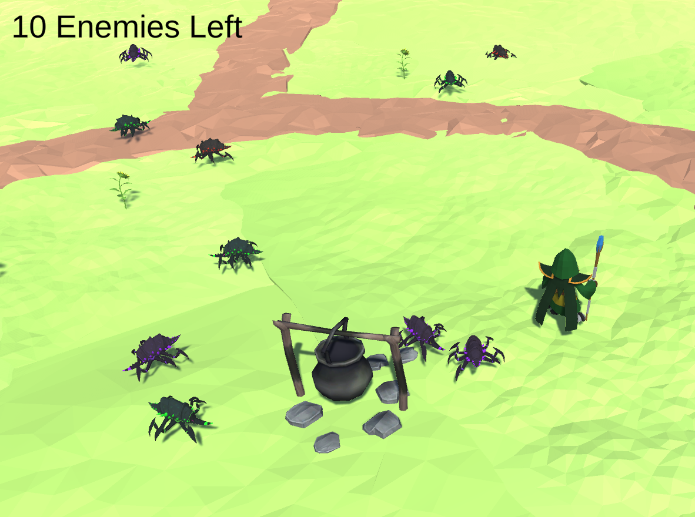
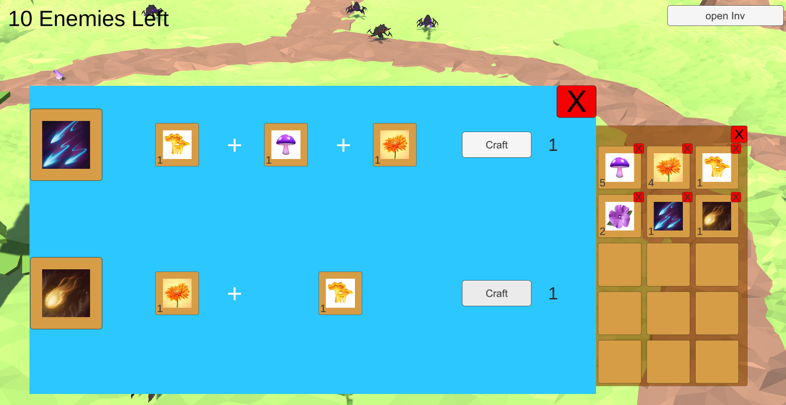

# Whitcher & Bugs (By Unity)

## Technologies
* ScriptableObject
* State Machine Pattern
* Cinemachine

## Play The Game
download [here](https://drive.google.com/file/d/1JI7fzOyk6m1fAKZJvbFXPF5WjSCtNOms/view?usp=sharing)
## clone repo
    git clone https://github.com/salahbesbes/NewRepo.git

## showCase

## Assets
* [whitch's house](https://assetstore.unity.com/packages/3d/environments/fantasy/whitch-s-house-125519)

* [low poly nature forest](https://assetstore.unity.com/packages/3d/environments/landscapes/free-low-poly-nature-forest-205742)

* [polygonal-metalon](https://assetstore.unity.com/packages/3d/characters/creatures/meshtint-free-polygonal-metalon-151383)

 * [battle wizard poly art](https://assetstore.unity.com/packages/3d/characters/humanoids/fantasy/battle-wizard-poly-art-128097)

